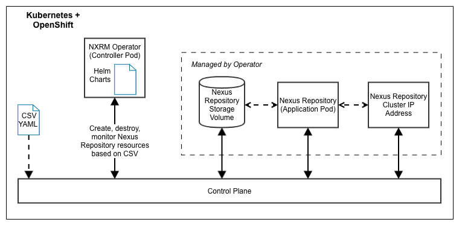

# Document Purpose

This page provides high-level technical information regarding the **IBM Operator for Nexus Repository Manager (NXRM)**

## Product Overview

Operators are a [design pattern in Kubernetes](https://kubernetes.io/docs/concepts/extend-kubernetes/operator/) and OpenShift for packaging and distributing the logic of starting,  stopping, and otherwise managing an application in a cluster. It's meant to replace some of the work a human may have previously done. The Sonatype Lifecycle Operator provide basic installation and removal of Lifecycle from an OpenShift cluster. It is distributed with Red Hat Certification in the Operator Hub within OpenShift to provide a relatively simple way for users to install and startup the latest versions of Lifecycle software in their clusters.

## High-Level Technical Description

## Internal Dependencies

* Certified Container for NXRM
* NXRM Helm Chart

## External Dependencies

* Red Hat build service
* Red Hat CodeReady Containers (CRC)

## Data Persistence

N/A

## Local Development

See the [README.md](README.md) file
